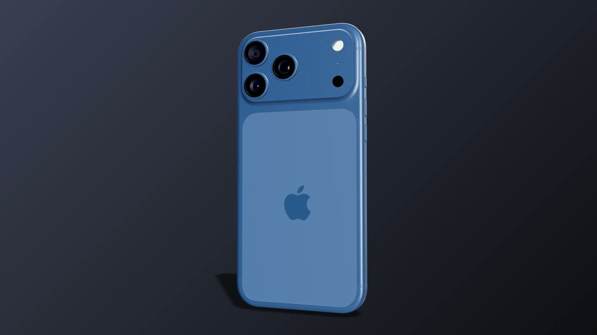
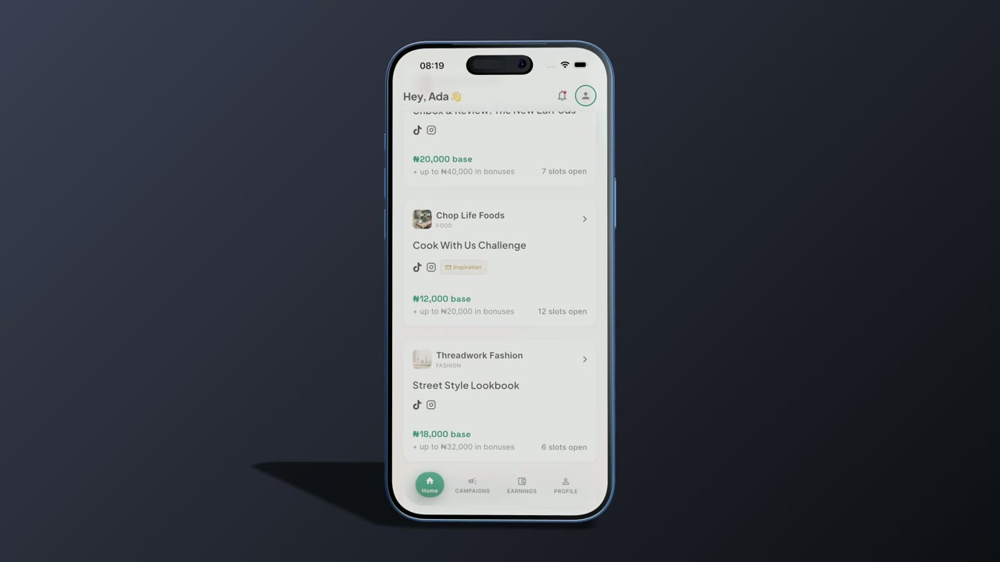

# 3D Device Mockup Studio

An open-source, browser-based studio for turning screenshots and screen
recordings into animated 3D device mockups. It is designed as a local-first
alternative to tools such as Rotato: import media, choose a device and scene,
adjust the composition, then export a still image or video.

> **Project status:** early alpha. The rendering and export foundations are
> working, but the editor and public project documentation are still evolving.

This project is independent and is not affiliated with or endorsed by Rotato,
Apple, Google, Samsung, or any other device manufacturer.

## Made with the studio

Click either preview to watch the full-resolution MP4 export.

| Product spin | Animated screen |
|---|---|
| [](docs/assets/device-product-spin.mp4) | [](docs/assets/device-screen-demo.mp4) |

## Features

- Screenshot and screen-recording placement on 3D device displays
- Multiple devices in one scene
- Device orientation, colorway, position, rotation, and scale controls
- Reusable single-, dual-, and triple-device scene templates
- Camera presets and editable camera transforms
- Solid, gradient, image, and transparent backgrounds
- Deterministic keyframe animation with easing and motion presets
- High-resolution PNG export with supersampling
- Frame-accurate PNG sequence export
- WebM and MP4 video export through WebCodecs when supported
- Local media storage using OPFS with an IndexedDB fallback
- Portable `.mockup` project files containing project data and media
- Undo, redo, keyboard shortcuts, and image/movie editing modes

All project processing happens in the browser. There are no accounts, cloud
uploads, analytics, or collaboration services in the current application.

## Quick start

Node.js 22 and npm are recommended.

```bash
npm ci
npm run dev
```

Vite prints the local development URL. Open it in a Chromium-based browser for
the most complete video import and export support.

## Commands

```bash
npm run dev        # Start the development server
npm run build      # Type-check and create a production build
npm run preview    # Preview the production build locally
npm test           # Run the test suite once
npm run test:watch # Run tests while editing
npm run lint       # Run Oxlint
```

Before submitting a change, run:

```bash
npm test
npm run build
npm run lint
```

## Browser support

Still-image editing and PNG export use standard browser and WebGL APIs. Video
export depends on WebCodecs and the codecs exposed by the current browser and
operating system.

- Chromium-based browsers provide the most complete experience.
- MP4 and WebM availability is feature-detected for the requested dimensions.
- Transparent video is shown only when the browser reports a supported alpha
  encoder configuration.
- PNG sequence export is the deterministic fallback when a video codec is not
  available.
- Large, supersampled exports can consume substantial GPU and system memory.

## How it works

The project document is plain serializable data managed by Zustand. Animation
is evaluated by the pure `sampleTimeline(project, time)` function, producing a
scene state with no dependence on wall-clock time or previous frames.

Preview and export then follow the same path:

```text
Project document
      ↓
sampleTimeline(project, t)
      ↓
Scene state
      ↓
Shared Three.js scene
      ↓
Preview, PNG, PNG sequence, WebM, or MP4
```

This makes an exported frame at time `t` match the preview at the same time.
The exporter pauses the interactive render loop, applies an exact timeline
sample, renders, captures, downsamples, and restores the preview state.

## Project structure

```text
src/
  app/       Keyboard shortcuts and application-level behavior
  devices/   Device manifests and model metadata
  export/    Still, sequence, video, sizing, and frame rendering
  media/     Image/video loading and local blob storage
  scene/     Three.js and React Three Fiber scene components
  store/     Project schema, persistence, history, and editor state
  timeline/  Tracks, easing, sampling, presets, and templates
  ui/        Editor controls and panels
public/
  devices/   Runtime GLB device models
```

The detailed implementation history and rendering decisions are documented in
[`CONTEXT.md`](CONTEXT.md). The original product and architecture specification
is in [`mockup-app-spec.md`](mockup-app-spec.md).

## Known limitations

- Timeline keyframes are displayed but are not yet draggable in the timeline.
- Text/annotation layers, depth of field, and motion blur are placeholders.
- Video codec and alpha support vary by browser, OS, resolution, and GPU.
- The editor has not yet received broad cross-browser or mobile testing.
- Large GLBs contribute significantly to repository and deployment size.

## Device models and other assets

The Apache-2.0 license applies to the project source code, not automatically to
third-party models, textures, icons, or other media.

- See [`ASSETS.md`](ASSETS.md) for provenance and release status.
- See [`THIRD_PARTY_NOTICES.md`](THIRD_PARTY_NOTICES.md) for attribution.
- Do not add a model without recording its source, license, required notices,
  and distributed-file checksum.

## Contributing

Issues and pull requests are welcome. Keep rendering changes deterministic:
scene state should be derived from the project and timeline time, never from
accumulated frame deltas. New devices should be manifest-driven and include
provenance records, physical measurements, and screen-orientation tests.

Read [CONTRIBUTING.md](CONTRIBUTING.md) before starting substantial work. All
participants must follow the [Code of Conduct](CODE_OF_CONDUCT.md). Report
security issues privately according to [SECURITY.md](SECURITY.md).

## License

The source code is licensed under the [Apache License 2.0](LICENSE). Third-party
assets retain their own licenses as described above.
